# Neural-Network

## Lab01

#### Ogólny przegląd danych

Additional Information

This database contains 76 attributes, but all published experiments refer to using a subset of 14 of them. In
particular, the Cleveland database is the only one that has been used by ML researchers to date. The "goal" field refers
to the presence of heart disease in the patient. It is integer valued from 0 (no presence) to 4. Experiments with the
Cleveland database have concentrated on simply attempting to distinguish presence (values 1,2,3,4) from absence (value
0).

wartości liczbowe atrybutu num:
-0 brak oznak choroby
-1,2,3,4 występujące oznaki choroby

<div>
<table border="1" class="dataframe">
  <thead>
    <tr style="text-align: right;">
      <th></th>
      <th>name</th>
      <th>role</th>
      <th>type</th>
      <th>demographic</th>
      <th>description</th>
      <th>units</th>
      <th>missing_values</th>
    </tr>
  </thead>
  <tbody>
    <tr>
      <th>0</th>
      <td>age</td>
      <td>Feature</td>
      <td>Integer</td>
      <td>Age</td>
      <td>None</td>
      <td>years</td>
      <td>no</td>
    </tr>
    <tr>
      <th>1</th>
      <td>sex</td>
      <td>Feature</td>
      <td>Categorical</td>
      <td>Sex</td>
      <td>None</td>
      <td>None</td>
      <td>no</td>
    </tr>
    <tr>
      <th>2</th>
      <td>cp</td>
      <td>Feature</td>
      <td>Categorical</td>
      <td>None</td>
      <td>None</td>
      <td>None</td>
      <td>no</td>
    </tr>
    <tr>
      <th>3</th>
      <td>trestbps</td>
      <td>Feature</td>
      <td>Integer</td>
      <td>None</td>
      <td>resting blood pressure (on admission to the ho...</td>
      <td>mm Hg</td>
      <td>no</td>
    </tr>
    <tr>
      <th>4</th>
      <td>chol</td>
      <td>Feature</td>
      <td>Integer</td>
      <td>None</td>
      <td>serum cholestoral</td>
      <td>mg/dl</td>
      <td>no</td>
    </tr>
    <tr>
      <th>5</th>
      <td>fbs</td>
      <td>Feature</td>
      <td>Categorical</td>
      <td>None</td>
      <td>fasting blood sugar &gt; 120 mg/dl</td>
      <td>None</td>
      <td>no</td>
    </tr>
    <tr>
      <th>6</th>
      <td>restecg</td>
      <td>Feature</td>
      <td>Categorical</td>
      <td>None</td>
      <td>None</td>
      <td>None</td>
      <td>no</td>
    </tr>
    <tr>
      <th>7</th>
      <td>thalach</td>
      <td>Feature</td>
      <td>Integer</td>
      <td>None</td>
      <td>maximum heart rate achieved</td>
      <td>None</td>
      <td>no</td>
    </tr>
    <tr>
      <th>8</th>
      <td>exang</td>
      <td>Feature</td>
      <td>Categorical</td>
      <td>None</td>
      <td>exercise induced angina</td>
      <td>None</td>
      <td>no</td>
    </tr>
    <tr>
      <th>9</th>
      <td>oldpeak</td>
      <td>Feature</td>
      <td>Integer</td>
      <td>None</td>
      <td>ST depression induced by exercise relative to ...</td>
      <td>None</td>
      <td>no</td>
    </tr>
    <tr>
      <th>10</th>
      <td>slope</td>
      <td>Feature</td>
      <td>Categorical</td>
      <td>None</td>
      <td>None</td>
      <td>None</td>
      <td>no</td>
    </tr>
    <tr>
      <th>11</th>
      <td>ca</td>
      <td>Feature</td>
      <td>Integer</td>
      <td>None</td>
      <td>number of major vessels (0-3) colored by flour...</td>
      <td>None</td>
      <td>yes</td>
    </tr>
    <tr>
      <th>12</th>
      <td>thal</td>
      <td>Feature</td>
      <td>Categorical</td>
      <td>None</td>
      <td>None</td>
      <td>None</td>
      <td>yes</td>
    </tr>
    <tr>
      <th>13</th>
      <td>num</td>
      <td>Target</td>
      <td>Integer</td>
      <td>None</td>
      <td>diagnosis of heart disease</td>
      <td>None</td>
      <td>no</td>
    </tr>
  </tbody>
</table>
</div>

<div>
    X
<table border="1" class="dataframe">
  <thead>
    <tr style="text-align: right;">
      <th></th>
      <th>age</th>
      <th>sex</th>
      <th>cp</th>
      <th>trestbps</th>
      <th>chol</th>
      <th>fbs</th>
      <th>restecg</th>
      <th>thalach</th>
      <th>exang</th>
      <th>oldpeak</th>
      <th>slope</th>
      <th>ca</th>
      <th>thal</th>
    </tr>
  </thead>
  <tbody>
    <tr>
      <th>0</th>
      <td>63</td>
      <td>1</td>
      <td>1</td>
      <td>145</td>
      <td>233</td>
      <td>1</td>
      <td>2</td>
      <td>150</td>
      <td>0</td>
      <td>2.3</td>
      <td>3</td>
      <td>0.0</td>
      <td>6.0</td>
    </tr>
    <tr>
      <th>1</th>
      <td>67</td>
      <td>1</td>
      <td>4</td>
      <td>160</td>
      <td>286</td>
      <td>0</td>
      <td>2</td>
      <td>108</td>
      <td>1</td>
      <td>1.5</td>
      <td>2</td>
      <td>3.0</td>
      <td>3.0</td>
    </tr>
    <tr>
      <th>2</th>
      <td>67</td>
      <td>1</td>
      <td>4</td>
      <td>120</td>
      <td>229</td>
      <td>0</td>
      <td>2</td>
      <td>129</td>
      <td>1</td>
      <td>2.6</td>
      <td>2</td>
      <td>2.0</td>
      <td>7.0</td>
    </tr>
    <tr>
      <th>3</th>
      <td>37</td>
      <td>1</td>
      <td>3</td>
      <td>130</td>
      <td>250</td>
      <td>0</td>
      <td>0</td>
      <td>187</td>
      <td>0</td>
      <td>3.5</td>
      <td>3</td>
      <td>0.0</td>
      <td>3.0</td>
    </tr>
    <tr>
      <th>4</th>
      <td>41</td>
      <td>0</td>
      <td>2</td>
      <td>130</td>
      <td>204</td>
      <td>0</td>
      <td>2</td>
      <td>172</td>
      <td>0</td>
      <td>1.4</td>
      <td>1</td>
      <td>0.0</td>
      <td>3.0</td>
    </tr>
    <tr>
      <th>...</th>
      <td>...</td>
      <td>...</td>
      <td>...</td>
      <td>...</td>
      <td>...</td>
      <td>...</td>
      <td>...</td>
      <td>...</td>
      <td>...</td>
      <td>...</td>
      <td>...</td>
      <td>...</td>
      <td>...</td>
    </tr>
    <tr>
      <th>298</th>
      <td>45</td>
      <td>1</td>
      <td>1</td>
      <td>110</td>
      <td>264</td>
      <td>0</td>
      <td>0</td>
      <td>132</td>
      <td>0</td>
      <td>1.2</td>
      <td>2</td>
      <td>0.0</td>
      <td>7.0</td>
    </tr>
    <tr>
      <th>299</th>
      <td>68</td>
      <td>1</td>
      <td>4</td>
      <td>144</td>
      <td>193</td>
      <td>1</td>
      <td>0</td>
      <td>141</td>
      <td>0</td>
      <td>3.4</td>
      <td>2</td>
      <td>2.0</td>
      <td>7.0</td>
    </tr>
    <tr>
      <th>300</th>
      <td>57</td>
      <td>1</td>
      <td>4</td>
      <td>130</td>
      <td>131</td>
      <td>0</td>
      <td>0</td>
      <td>115</td>
      <td>1</td>
      <td>1.2</td>
      <td>2</td>
      <td>1.0</td>
      <td>7.0</td>
    </tr>
    <tr>
      <th>301</th>
      <td>57</td>
      <td>0</td>
      <td>2</td>
      <td>130</td>
      <td>236</td>
      <td>0</td>
      <td>2</td>
      <td>174</td>
      <td>0</td>
      <td>0.0</td>
      <td>2</td>
      <td>1.0</td>
      <td>3.0</td>
    </tr>
    <tr>
      <th>302</th>
      <td>38</td>
      <td>1</td>
      <td>3</td>
      <td>138</td>
      <td>175</td>
      <td>0</td>
      <td>0</td>
      <td>173</td>
      <td>0</td>
      <td>0.0</td>
      <td>1</td>
      <td>NaN</td>
      <td>3.0</td>
    </tr>
  </tbody>
</table>
</div>


<div>
y
<table border="1" class="dataframe">
  <thead>
    <tr style="text-align: right;">
      <th></th>
      <th>num</th>
    </tr>
  </thead>
  <tbody>
    <tr>
      <th>0</th>
      <td>0</td>
    </tr>
    <tr>
      <th>1</th>
      <td>2</td>
    </tr>
    <tr>
      <th>2</th>
      <td>1</td>
    </tr>
    <tr>
      <th>3</th>
      <td>0</td>
    </tr>
    <tr>
      <th>4</th>
      <td>0</td>
    </tr>
    <tr>
      <th>...</th>
      <td>...</td>
    </tr>
    <tr>
      <th>298</th>
      <td>1</td>
    </tr>
    <tr>
      <th>299</th>
      <td>2</td>
    </tr>
    <tr>
      <th>300</th>
      <td>3</td>
    </tr>
    <tr>
      <th>301</th>
      <td>1</td>
    </tr>
    <tr>
      <th>302</th>
      <td>0</td>
    </tr>
  </tbody>
</table>
<p>303 rows × 1 columns</p>
</div>

#### 1.Czy zbiór jest zbalansowany pod względem liczby próbek na klasy?

<table>
  <tr>
    <td>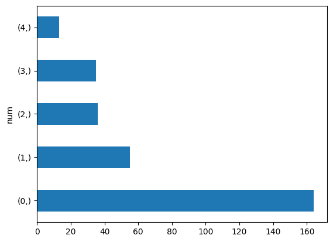</td>
    <td>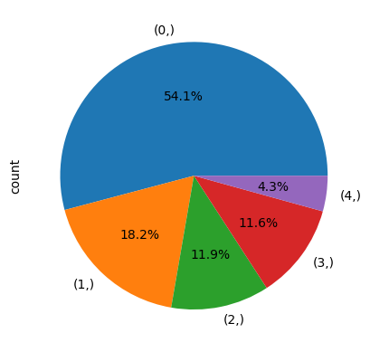</td>
  </tr>
</table>

Można zauważyć, że najwięcej przypadków jest dla wartości 0, która stanowi ponad połowę wszystkich wartości, jeśli
chodzi o pozostałe, przypadek 1 posiada również duży wkład, 2 i 3 mają prawie taką samą częstotliwość na poziomie
ok.12%, przypadek 4 jest najmniej liczny i stanowi niecałe 5%.

Odpowiedź:
Zbiór danych nie jest najlepiej zbalansowany, ponieważ niektóre klasy mają znacznie więcej próbek niż inne.

<table>
  <tr>
    <td>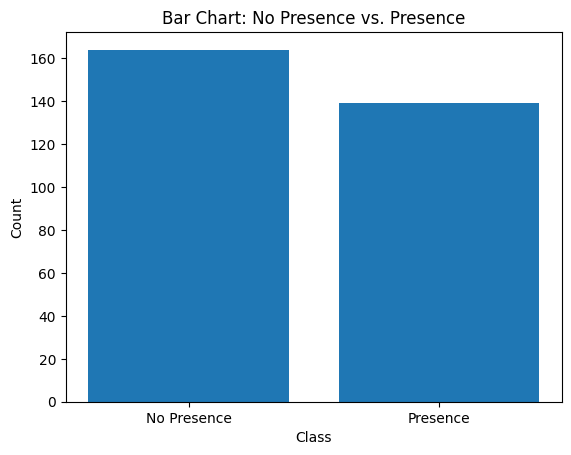</td>
    <td>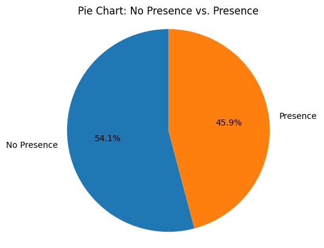</td>
  </tr>
</table>

Jeśli jednak pójść dalej i zobaczyć na wartości atrybutu num w perspektywie - 'ma objawy' 'nie ma objawow', rozkład
będzie bardziej zbalansowany.

#### 2. Jakie są średnie i odchylenia cech liczbowych?

    0          age
    3     trestbps
    4         chol
    7      thalach
    9      oldpeak
    11          ca
    Name: name, dtype: object

<div>
<table border="1" class="dataframe">
  <thead>
    <tr style="text-align: right;">
      <th></th>
      <th>age</th>
      <th>trestbps</th>
      <th>chol</th>
      <th>thalach</th>
      <th>oldpeak</th>
      <th>ca</th>
    </tr>
  </thead>
  <tbody>
    <tr>
      <th>mean</th>
      <td>54.438944</td>
      <td>131.689769</td>
      <td>246.693069</td>
      <td>149.607261</td>
      <td>1.039604</td>
      <td>0.672241</td>
    </tr>
    <tr>
      <th>std</th>
      <td>9.038662</td>
      <td>17.599748</td>
      <td>51.776918</td>
      <td>22.875003</td>
      <td>1.161075</td>
      <td>0.937438</td>
    </tr>
  </tbody>
</table>
</div>

#### 3. Dla cech liczbowych: czy ich rozkład jest w przybliżeniu normalny?


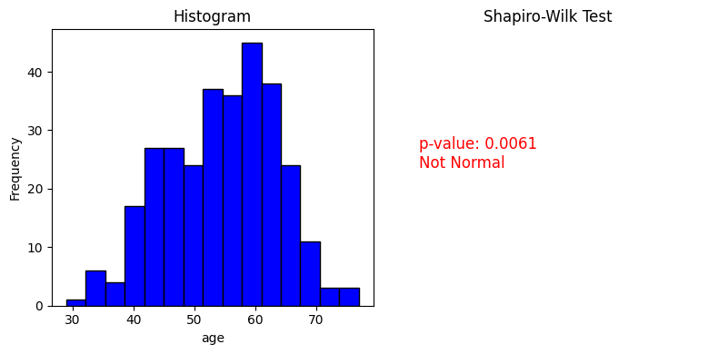

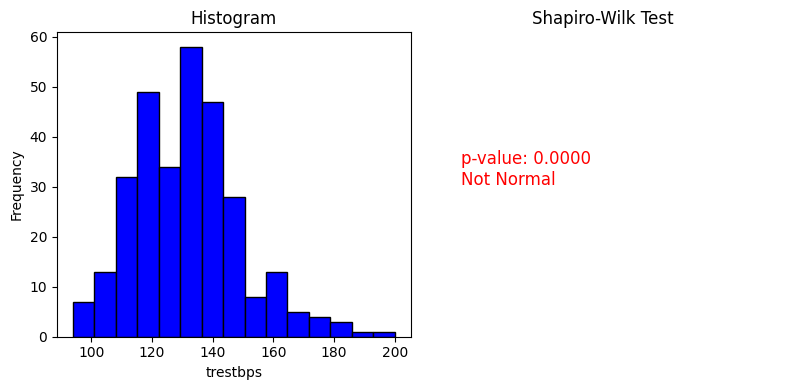

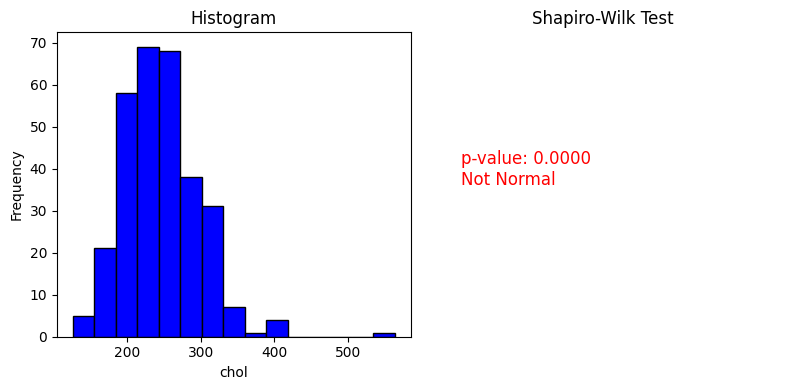

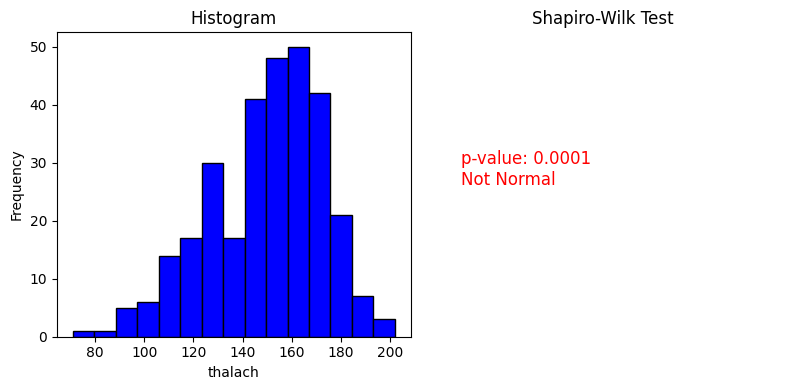

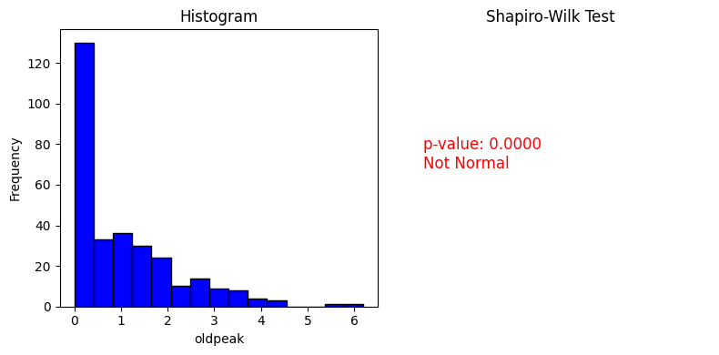

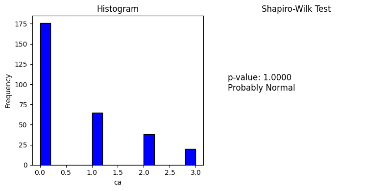

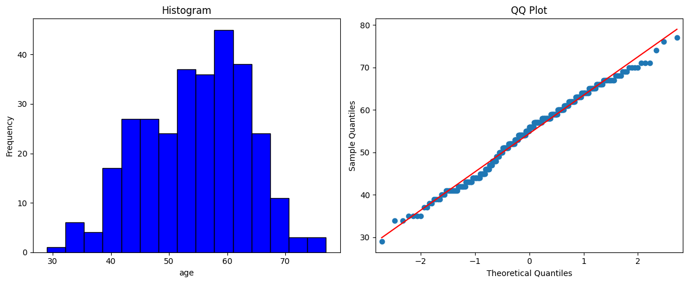

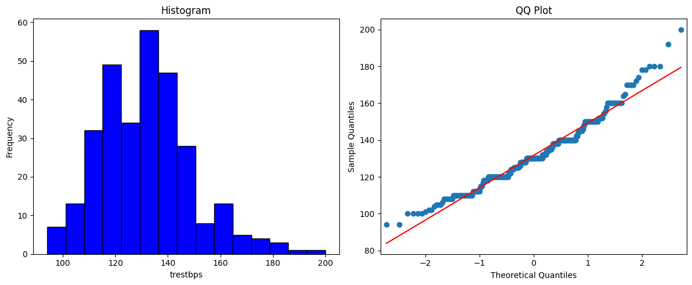

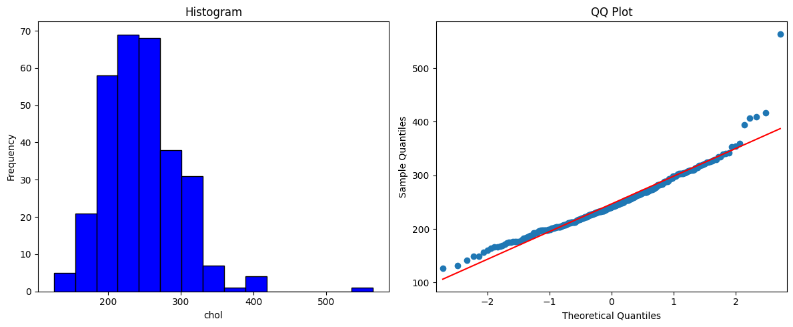

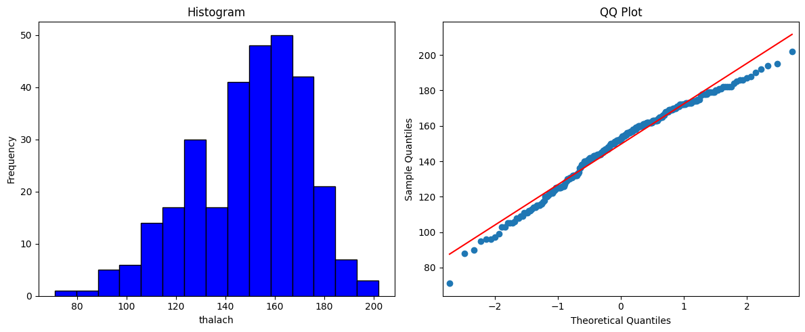

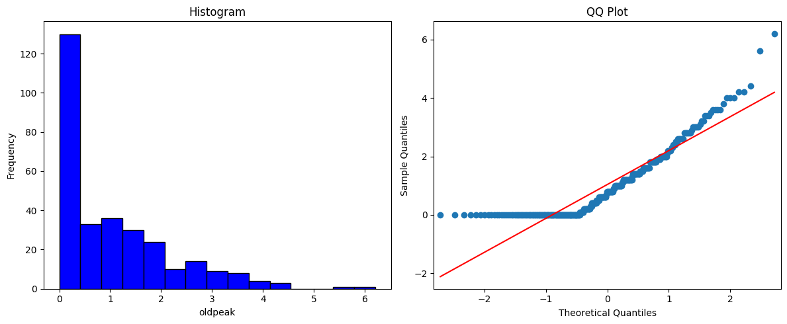

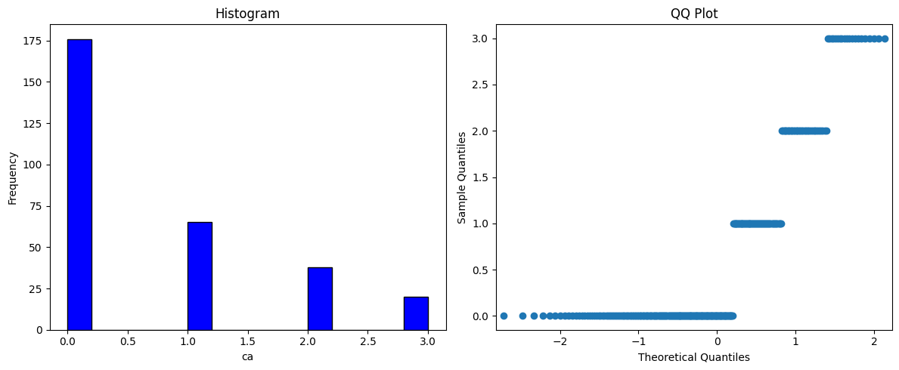

Badając te kwestię postanowiłem sprawdzić najpierw testem Shapiro-Wilka, czy wartości są rozdystrybuowane w sposób
normalny, jednak patrząc na histogramy danych i wyniki testu postanowiłem sprawdzić czy dane są w 'przybliżeniu'
rozdystrybuowane w sposób normalny, więc postanowiłem sprawdzić mniej restrykcyjnym testem. Wykres kwantylowy (qqplot).
Można z tego wyciągnąć, że atrybuty:

- thalach
- chol
- age

mają rozkład podobny do normalnego.

#### 4. Dla cech kategorycznych: czy rozkład jest w przybliżeniu równomierny?


    1         sex
    2          cp
    5         fbs
    6     restecg
    8       exang
    10      slope
    12       thal
    Name: name, dtype: object


<div>
<table border="1" class="dataframe">
  <thead>
    <tr style="text-align: right;">
      <th></th>
      <th>sex</th>
      <th>cp</th>
      <th>fbs</th>
      <th>restecg</th>
      <th>exang</th>
      <th>slope</th>
      <th>thal</th>
    </tr>
  </thead>
  <tbody>
    <tr>
      <th>0</th>
      <td>1</td>
      <td>1</td>
      <td>1</td>
      <td>2</td>
      <td>0</td>
      <td>3</td>
      <td>6.0</td>
    </tr>
    <tr>
      <th>1</th>
      <td>1</td>
      <td>4</td>
      <td>0</td>
      <td>2</td>
      <td>1</td>
      <td>2</td>
      <td>3.0</td>
    </tr>
    <tr>
      <th>2</th>
      <td>1</td>
      <td>4</td>
      <td>0</td>
      <td>2</td>
      <td>1</td>
      <td>2</td>
      <td>7.0</td>
    </tr>
    <tr>
      <th>3</th>
      <td>1</td>
      <td>3</td>
      <td>0</td>
      <td>0</td>
      <td>0</td>
      <td>3</td>
      <td>3.0</td>
    </tr>
    <tr>
      <th>4</th>
      <td>0</td>
      <td>2</td>
      <td>0</td>
      <td>2</td>
      <td>0</td>
      <td>1</td>
      <td>3.0</td>
    </tr>
    <tr>
      <th>...</th>
      <td>...</td>
      <td>...</td>
      <td>...</td>
      <td>...</td>
      <td>...</td>
      <td>...</td>
      <td>...</td>
    </tr>
    <tr>
      <th>298</th>
      <td>1</td>
      <td>1</td>
      <td>0</td>
      <td>0</td>
      <td>0</td>
      <td>2</td>
      <td>7.0</td>
    </tr>
    <tr>
      <th>299</th>
      <td>1</td>
      <td>4</td>
      <td>1</td>
      <td>0</td>
      <td>0</td>
      <td>2</td>
      <td>7.0</td>
    </tr>
    <tr>
      <th>300</th>
      <td>1</td>
      <td>4</td>
      <td>0</td>
      <td>0</td>
      <td>1</td>
      <td>2</td>
      <td>7.0</td>
    </tr>
    <tr>
      <th>301</th>
      <td>0</td>
      <td>2</td>
      <td>0</td>
      <td>2</td>
      <td>0</td>
      <td>2</td>
      <td>3.0</td>
    </tr>
    <tr>
      <th>302</th>
      <td>1</td>
      <td>3</td>
      <td>0</td>
      <td>0</td>
      <td>0</td>
      <td>1</td>
      <td>3.0</td>
    </tr>
  </tbody>
</table>
<p>303 rows × 7 columns</p>
</div>

| Obraz 1 | Obraz 2 |
|---------|---------|
| 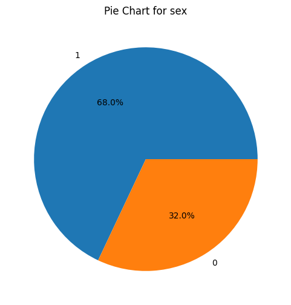 | 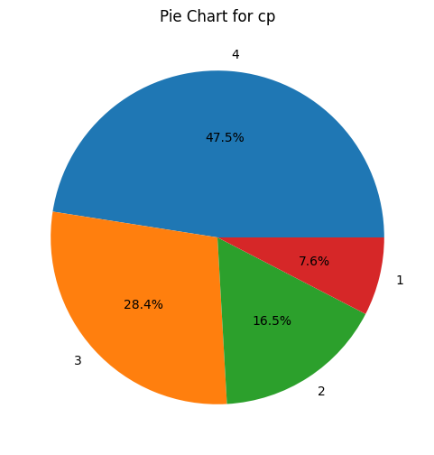 |
| Obraz 3 | Obraz 4 |
| 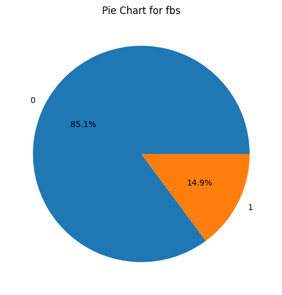 | 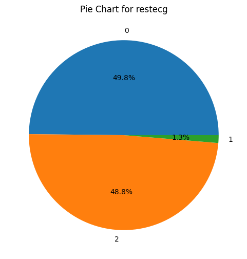 |
| Obraz 5 | Obraz 6 |
|  | 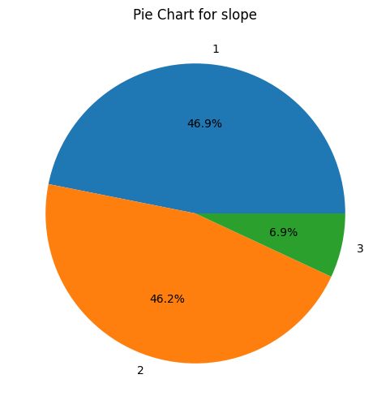 |
| Obraz 7 |
| 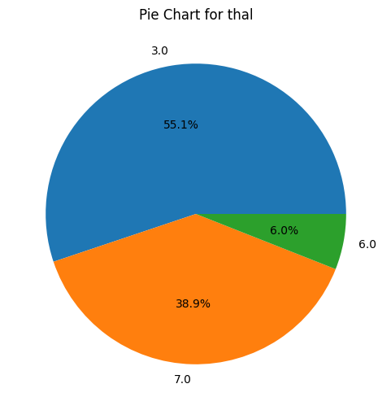 |


Rozkład wartości atrybutów kategorycznych jest różny, w większości przypadków nierównomierny, zależnie od atrybutu.
w niektórych przypadkach jest spora dysproporcja w danych, ale przeważnie dla jednego z 3 przypadków.
np. **thal,slope,restec**
W przypadku **sex, fbs** znacznie przeważa jedna kategoria.
Najbardziej równomierny jest zbiór **cp**

#### 5. Czy występują cechy brakujące i jaką strategię możemy zastosować żeby je zastąpić?
Dla X:

    ca          4
    thal        2
    age         0
    sex         0
    cp          0
    trestbps    0
    chol        0
    fbs         0
    restecg     0
    thalach     0
    exang       0
    oldpeak     0
    slope       0
    dtype: int64
Dla y:

    num    0
    dtype: int64

W przypadku **ca** uzupełnię brakujące wartości modą. Ponieważ jest to wartość numeryczna lecz przyjmuje wartości dyskretne. W przypadku **thal**
uzupełnię je modą, ponieważ jest to atrybut kategoryczny.

## Lab02

Sieci Neuronowe

Wynikiem implementacji listy jest program podzielony na 3 pliki:

- Functions.py -- funkcje pomocnicze, dyskretyzacja danych,
  normalizacja danych, obliczenie metryk dla zestawu testowego.

- Main.py -- środowisko testowe, w nim testuje wizualizuje
  zaimplementowane metody i funkcje.

- NeuralNetwork.py -- klasa prostej sieci neuronowej, opartej na
  gradiencie z entropii krzyżowej.

Implementacja rozwiązania:

Wyjście w sieci było implementowane na wzór:

𝑝(𝑥) = 𝜎(𝑊𝑥 + 𝑏)

``` Python
    def p(self, x):
        argument = np.dot(x, self.W) + self.b
        return self.sigmoid(argument)
```

gdzie funkcja sigmoid to:

<div style="text-align:center;">

$\sigma(n) = \frac{1}{1 + e^{-n}}$
</div>

Co w pythonie może być osiągnięte za pomocą funkcji
[expit(x)](https://docs.scipy.org/doc/scipy/reference/generated/scipy.special.expit.html)
:

``` Python
    def sigmoid(self, n):
    return expit(n)
```

Jako funkcję kosztu wykorzystujemy entropię krzyżową:
<div style="text-align:center;">
    𝐿 = −𝑦 ln 𝑝(𝑥) − (1 − 𝑦) ln(1 − 𝑝(𝑥))
</div>

``` Python
    def cross_entropy_loss(self, y, y_pred):
        epsilon = 1e-15
        loss = y * np.log(y_pred + epsilon) + (1 - y) * np.log(1 - y_pred +epsilon)
        return -np.sum(loss)
```

epsilon został dodany ponieważ był problem z liczeniem wartości 0.

Implementacja gradientu będzie za pomocą pochodnej po wagach modelu, co
z entropii krzyżowej daje:
<div style="display: flex; justify-content: center; align-items: center; height: 200px;">

$\frac{\partial L}{\partial w_i} = -(y - p(x))x$

$\frac{\partial L}{\partial w_i} = (p(x) - y)x$

</div>

``` Python
    def compute_gradient(self, X_train, y_train):
        y_pred = self.p(X_train)
        dz = y_pred - y_train
        dw = np.dot(X_train.T, dz)
        db = np.sum(dz)
        return dw, db
```

Model uczy się na podstawie zmiany wag, tak aby iść w stronę wyznaczoną
przez gradient. Implementacja:

𝑤~i~′ = 𝑤~𝑖~ − 𝛼 $\frac{\partial L\ }{\partial wi}$

``` Python
    dw, db = self.compute_gradient(X_train, y_train)
```

Aktualizacja wag i bias zgodnie z gradientem i współczynnikiem
uczenia:

``` Python
    self.W -= self.learning_rate * dw
    self.b -= self.learning_rate * db
```

Mój model posiada również 3 funkcje które mogą go wyuczyć:

- Fit_model_covergence -- który mówi o wystarczająco małej zmianie aby
  przerwać proces uczenia.

- Fit -- podstawowa wersja ucząca model, przechodząca przez cały zbiór
  X razy.

- Fit_batches -- wersja rozszerzona o dzielenie zbioru na paczki o
  nadanej wielkości, przechodzi przez zbiór X razy.

Aby zmaksymalizować uczenie się modelu, dane przed każdą iteracją są
losowo mieszane.

Aby zobaczyć wpływ procesowania danych będę rozpatrywał wszystkie wyniki
kontekście 3 metod procesowania:

- Normalizacja

- Dyskretyzacja

- Surowe dane

Hiperparametry i parametry zostały wybrane dla każdego osobno tak aby
zmaksymalizować ich potencjał.

Wyniki uczenia dla parametrow i hiperparametrów:

**Surowe dane**

``` Python
    learning_rate_basic_without_b = 0.1
    learning_rate_basic_with_b = 0.001
    num_of_iterations_basic = 400
    batch_size = 100
```

| Obraz 1                            | Obraz 2                            | Obraz 3                            | Obraz 4                            |
|------------------------------------|------------------------------------|------------------------------------|------------------------------------|
| 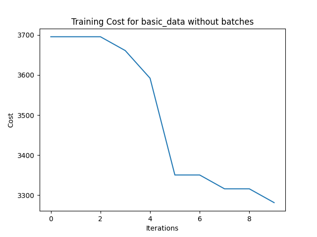 | 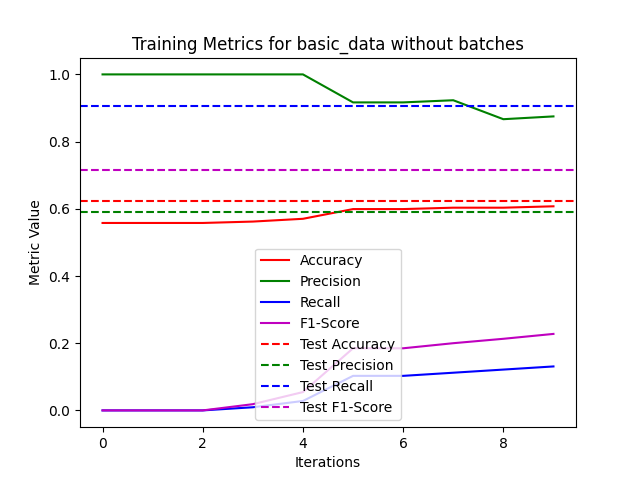 | 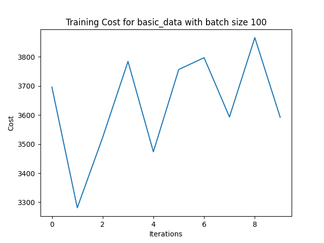 | 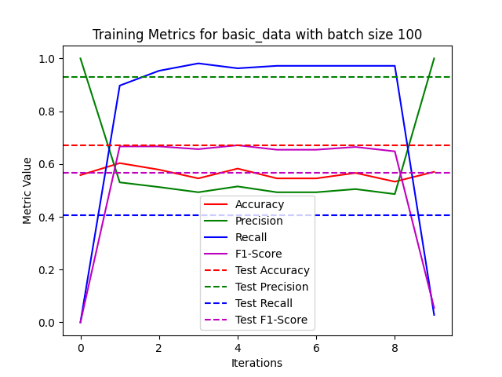 |
| Obraz 5                            | Obraz 6                            | Obraz 7                            | Obraz 8                            |
| 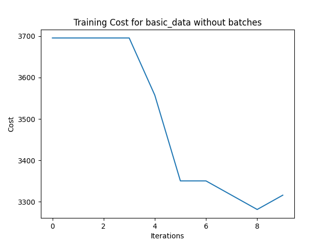 | 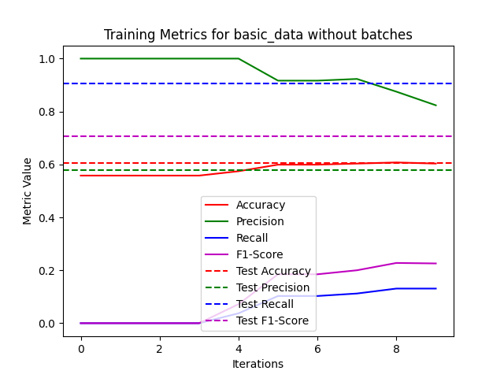 | 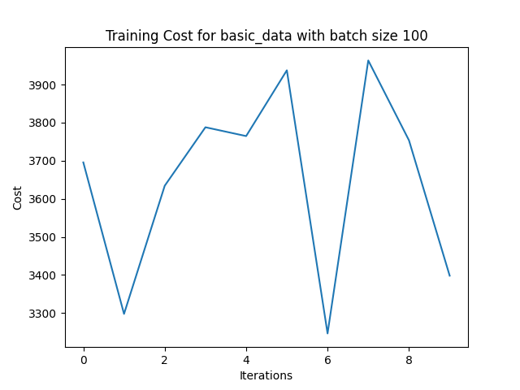 | 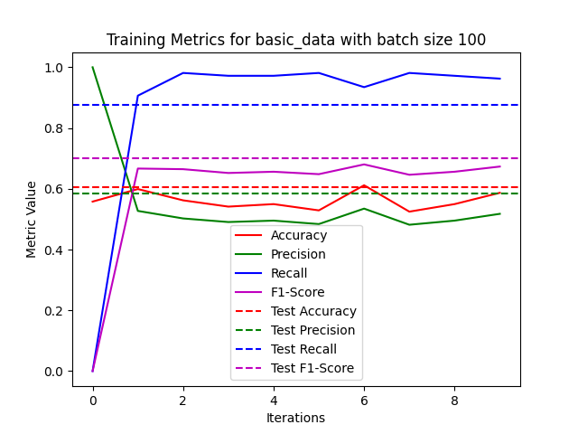 |

Możemy stąd zauważyć, że dane paczkowane, mają lepszy wynik ale są mniej
stabilne jeśli chodzi o metryki i proces uczenia.

Jendak oba wyniki są bardzo dobre, plasują się na poziomie \>=0.6 jeśli
chodzi o wszystkie metryki, co jest lepsze niż losowe zgadywanie.
Najlepsza

**Dane poddane dyskretyzacji:**

``` Python
learning_rate_discrete_without_b = 0.0005
learning_rate_discrete_with_b = 0.0005
batch_size = 64
num_of_iterations_discretization = 60
```

| Obraz 1                                 | Obraz 2                                 | Obraz 3                                 | Obraz 4                                 |
|-----------------------------------------|-----------------------------------------|-----------------------------------------|-----------------------------------------|
| 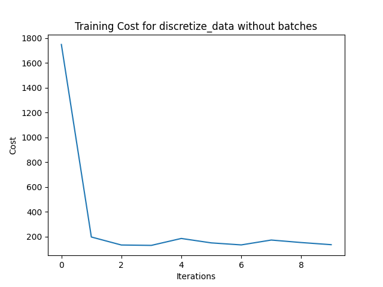 | 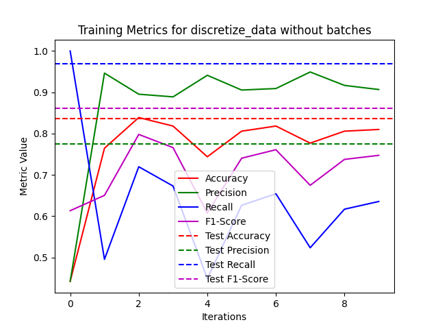 | 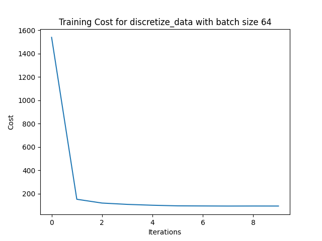 | 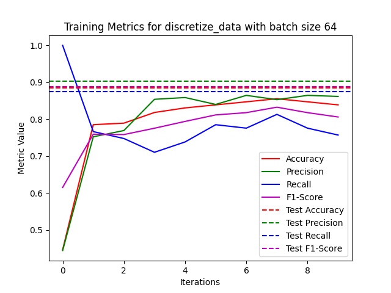 |
| Obraz 5                                 | Obraz 6                                 | Obraz 7                                 | Obraz 8                                 |
| 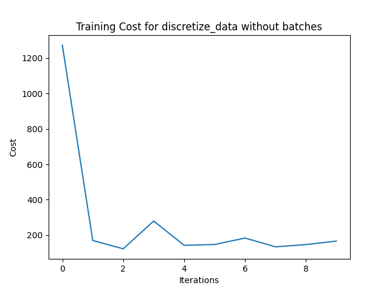 | 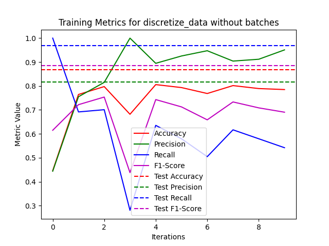 | 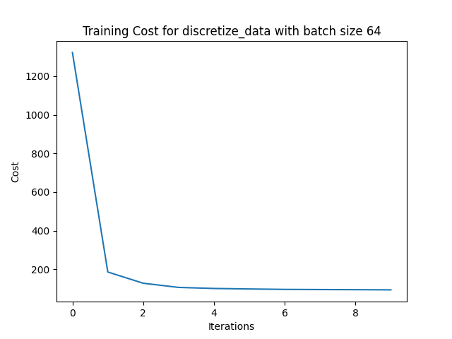 | 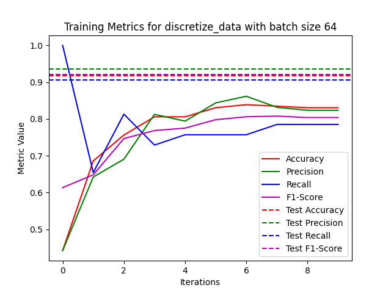 |

**Dane poddane normalizacji:**

``` Python
learning_rate_normalization_without_b = 0.001
learning_rate_normalization_with_b = 0.001
num_of_iterations_normalization = 200
batch_size= 128
```

| Obraz 1                                | Obraz 2                                | Obraz 3                                | Obraz 4                                |
|----------------------------------------|----------------------------------------|----------------------------------------|----------------------------------------|
| 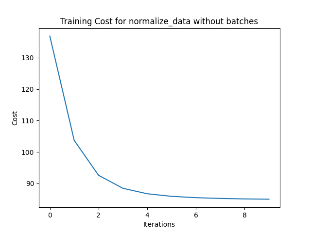 | 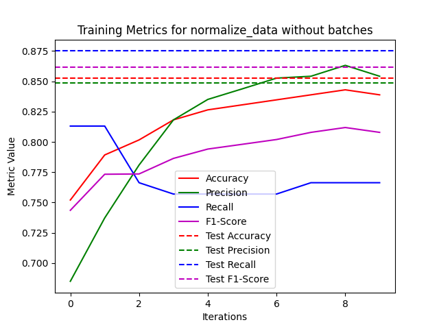 | 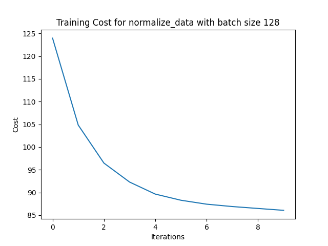 | 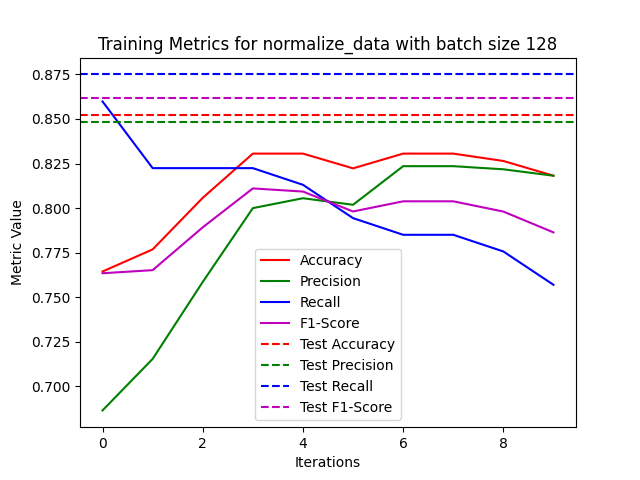 |
| Obraz 5                                | Obraz 6                                | Obraz 7                                | Obraz 8                                |
| 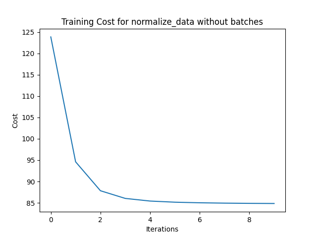 | 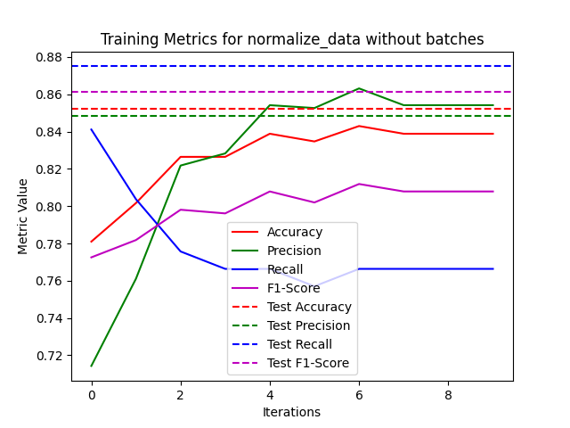 | 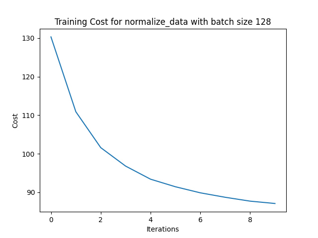 | 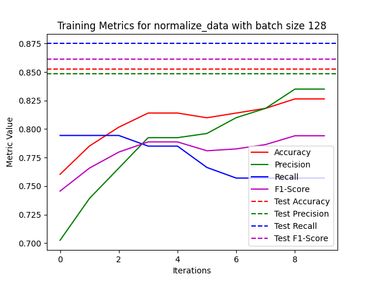 |

W tym przypadku możemy zauważyć, że jest zdecydowanie mniej iteracji bo
tylko 60 i model się stabilizuje, w przypadku paczkowania pomimo braku
wyraźnej różnicy na wykresie kosztu możemy zauważyć różnicę w miarach.
Wszystkie testowe miary wskazują ok. 90% poprawności, co jest wspaniałym
wynikiem.

W przypadku paczkowania możemy także zauważyć mniejsze wahania metryk.

Wnioski:

Dobranie odpowiednich parametrów i hiperparametrów odgrywa kluczową rolę
w powodzeniu modelu. Jest to ciężkie bez znajomości metod na znalezienie
optmalnych współczynników, trzeba sprawdzać to metodą prób i błędów.

Preprocessing też odgrywa ważną rolę w tym jak sprawuje się model.

Nawet taki prosty model może sobie dobrze radzić z binarną klasyfikacją.

## Lab03

Mój kod zawierający implementacje MLP (MultiLayer Percepton) składa się
z dwóch kalas:

-   Main.py -- używany do testowania i pokazywania wyników.

-   MLPClassifier.py -- zawiera implementacje MLP.

Klasy korzystają też z niektórych funkcji poprzednio zdefiniowanych w
Lab02.

Funkcją aktywacji jest funkcja sigmoid.

<div style="text-align:center;">

$\sigma(n) = \frac{1}{1 + e^{-n}}$

</div>

Funkcją straty jest entropia krzyżowa.
<div style="text-align:center;">
    $H(y, p) = -\sum_{i} (y_i \cdot \ln(p_i))$
</div>
Algorytm polega na trzech kluczowych funkcjach:

1.  Forward_propagation
    1.  Zastosować wektor wejściowy x~p~=\[x~p1~, x~p2~ \...,x~pN~\]

    2.  Obliczyć wartości sieciowego wejścia dla jednostek warstw
        ukrytej: z = Sum(w\*x)

    3.  Obliczyć wyjście z warstwy ukrytej: a = f(z)

    4.  Przejść do warstwy wyjściowej. Obliczyć wartość sieciowego
        wyjścia dla każdej jednostki. z~w~ = sum(w~w~\*a~w-1~)

    5.  Obliczyć wyjścia y_pred = f(z~w~) jeśli to ostatnia warstwa to
        użyć softmax.

2.  Backward_propagation
    1.  Obliczyć błąd dla jednostek wyjściowych.
    2.  Obliczyć błędy dla jednostek ukrytych.
3.  Update_waights
    1. Uaktualnić wagi w warstwie wyjściowej.
    2. Uaktualnić wagi w warstwie ukrytej.


Problem który staram się sklasyfikować to czy osoba z podanymi
parametrami jest:

    - chora w stopniu - 2, 1 
    - jest zdrowa - 0. 
Więc moim problemem teraz jest klasyfikacja wieloklasowa.

Model będzie testowany ze względu na:

1.  Danych znormalizowanych i nieznormalizowanych

!Po tej części będę brał pod uwagę tylko dane znormalizowane.!

2.  Różnej wymiarowości warstwy ukrytej

3.  Różnej wartości współczynnika uczenia

4.  Różnych odchyleń standardowych przy inicjalizacji wag

5.  Różnej liczby warstw

### 1. Zacznę od pokazania różnic w danych znormalizowanych, surowych i zdyskretyzowanych .

Hiperparametry:

learning_rate = 0.001\
num_of_iterations = 400\
batch_size = 100\
hidden_layers = (4,)

| Obraz 1                                       | Obraz 2                                      |
|-----------------------------------------------|----------------------------------------------|
|         |        |

| Obraz 3                                       | Obraz 4                                      |
|-----------------------------------------------|----------------------------------------------|
|         |        |

| Obraz 5                                       | Obraz 6                                      |
|-----------------------------------------------|----------------------------------------------|
|         |        |

Więc możemy po tym zauważyć, że dla danych znormalizowanych wyniki
wychodzą najlepiej, na nastepnym miejscu są dane nieprzerobione. Po
metrykach możemy zauważyć, ze model ma zbyt wiele epok, ponieważ pomimo
spadku kosztu w trenowaniu, modele bardzo wolno się podnoszą, o ile w
ogóle, jeśli chodzi o metryki.

2.  Różnej wymiarowości warstwy ukrytej.

learning_rate = 0.001\
num_of_iterations = 2000\
batch_size = 64\
hidden_layers = (X,)

| Obraz 1                                       | Obraz 2                                      |
|-----------------------------------------------|----------------------------------------------|
|         |        |

| Obraz 3                                       | Obraz 4                                      |
|-----------------------------------------------|----------------------------------------------|
|         |        |

| Obraz 5                                       | Obraz 6                                      |
|-----------------------------------------------|----------------------------------------------|
|         |        |


Z tych testów możemy zauważyć, że większa liczba neuronów w jednej i
jedynej warstwie ukrytej skutkuje lepszym podejmowaniem decyzji, krzywa
uczenia schodzi niżej z kosztem, oraz model podejmuje lepsze decyzje,
patrząc na miary.

Przy 4 neuronach jego miary plasowały się pomiędzy \[0.55,0.7), a jego
końcowy koszt był ok. 180.

Przy 64 neuronach jego miary były już \>0.6, a co ważniejsze koszt był w
okolicach 130.

Przy 64\> neuronach wyniki zaczęły spadać.

3.  Różnej wartości współczynnika uczenia

learning_rate = X\
num_of_iterations = 2000\
batch_size = 64\
hidden_layers = (64,)

| Obraz 1                                       | Obraz 2                                      |
|-----------------------------------------------|----------------------------------------------|
|         |        |

| Obraz 3                                       | Obraz 4                                      |
|-----------------------------------------------|----------------------------------------------|
|         |        |

| Obraz 5                                       | Obraz 6                                      |
|-----------------------------------------------|----------------------------------------------|
|         |        |


Jak możemy zauważyć na zdjęciach, współczynnik uczenia ma wielki wpływ
na proces uczenia.

Jeśli go zwiększymy model będzie mniej stabilny, co można zauważyć na
ostatnich zdjęciach.

Krzywa uczenia często się stabilizuje, a nawet wzrasta po kolejnych
iteracjach z dużym współczynnikiem.

W tym wypadku (z tymi hiperparametrami) najepiej prezentuje się
współczynnik \<=0.001.

4.  Różnych odchyleń standardowych przy inicjalizacji wag. Tutaj
    przetestuje losowanie wag z różnymi rozkładami. Wcześniej wagi były
    losowane pseudolosowo czyli za pomocą funkcji rand.

Kod i objaśnienie dzięki artykułowi:
[link](https://www.linkedin.com/pulse/review-initializing-neural-network-random-weights-rambaksh-prajapati/).

Teraz będę je rozlosowywał na 3 różne sposoby:

-   **Losowa inicjalizacja normalna:** W tej metodzie wagi są inicjowane
    losowo z rozkładu normalnego o określonej średniej i odchyleniu
    standardowym. Na przykład, jeśli chcemy zainicjować wagi ze średnią
    0 i odchyleniem standardowym 0,1.

| Obraz 1                                       | Obraz 2                                      |
|-----------------------------------------------|----------------------------------------------|
|         |        |


-   **Inicjalizacja Xavier:** Metoda ta została nazwana na cześć
    badacza, który ją zaproponował, Xaviera Glorota. W tej metodzie wagi
    są inicjowane przy użyciu rozkładu Gaussa ze średnią 0 i odchyleniem
    standardowym sqrt(1/n), gdzie n to liczba neuronów wejściowych.
    Inicjalizacja Xaviera jest skuteczna, gdy funkcja aktywacji jest
    tangensem hiperbolicznym lub funkcją sigmoidalną.

| Obraz 1                                       | Obraz 2                                      |
|-----------------------------------------------|----------------------------------------------|
|         |        |


-   **Inicjalizacja He:** Nazwa tej metody pochodzi od nazwiska badacza,
    który ją zaproponował, Kaiming He. W tej metodzie wagi są inicjowane
    przy użyciu rozkładu Gaussa ze średnią 0 i odchyleniem standardowym
    sqrt(2/n), gdzie n to liczba neuronów wejściowych. Inicjalizacja He
    jest skuteczna, gdy funkcja aktywacji jest funkcją ReLU.

| Obraz 1                                       | Obraz 2                                      |
|-----------------------------------------------|----------------------------------------------|
|         |        |


Jak możemy zauważyć wszystkie modele podobnie się reprezentują, z tą
liczbą epok każdy model jest w stanie się naprostować i skorygować swoje
wagi. Jednak przy dobrze dobranej metodzie inicjalizacji wag, widzimy:

-   Niższy startowy koszt, funkcji straty.

-   Wyższe początkowe miary.

Są to ważne rzeczy, jeśli nasz model ma ograniczony czas uczenia.

5.  Różnej liczby warstw

| Obraz 1                                       | Obraz 2                                      |
|-----------------------------------------------|----------------------------------------------|
|         |        |

| Obraz 3                                       | Obraz 4                                      |
|-----------------------------------------------|----------------------------------------------|
|         |        |

| Obraz 5                                       | Obraz 6                                      |
|-----------------------------------------------|----------------------------------------------|
|         |        |

| Obraz 7                                       | Obraz 8                                      |
|-----------------------------------------------|----------------------------------------------|
|         |        |


Można po tym zauważyć, że wielkość, jak i ilość warstw ma znaczenie.
Większa ilość warstw pozwala zoptymalizować koszt jak i poprawić jakość
metryk. Jednak zbyt wielka ilość neuronów i warstw może źle wpłynąć na
model, który po prostu zapamięta rozwiązania nie generalizując.
